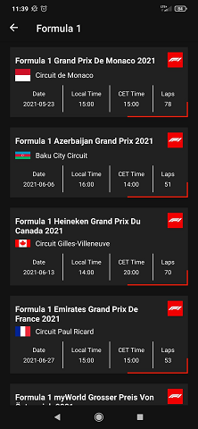
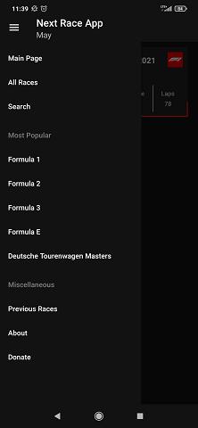
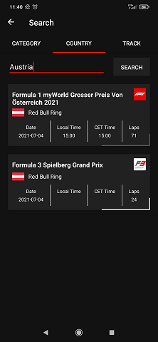

<!---->

# Next Race Mobile Application
>Next Race is a Mobile Android Application which provides user with informations about future motorsport events taking place all over the world.

## Table of contents
* [General Info](#general-info)
* [Download](#download)
* [Features](#features)
* [Technologies](#technologies)
* [Screenshots](#screenshots)
* [Status](#status)
* [Contact](#contact)
* [License](#license)

## General Info
>This Application was created to help motorsport enthusiasts find every important data about different races 

## Download

## Features
List of features ready and TODOs for future development
* Show all future races from all categories.
* Show races which have already taken place.
* Search for races by category / country / track. 
* Download data from api website. 

Todo list:
*

## Technologies
* Kotlin
* Retrofit
* SQLite

## Screenshots
<kbd></kbd>
<kbd></kbd>
<kbd></kbd>

## Status
Project is: _in progress_

## Contact
Created by [Piotr Wasilewski](mailto:wasilewski.piotr0@gmail.com) - feel free to contact me via email!

## License
[MIT](https://choosealicense.com/licenses/mit/)
